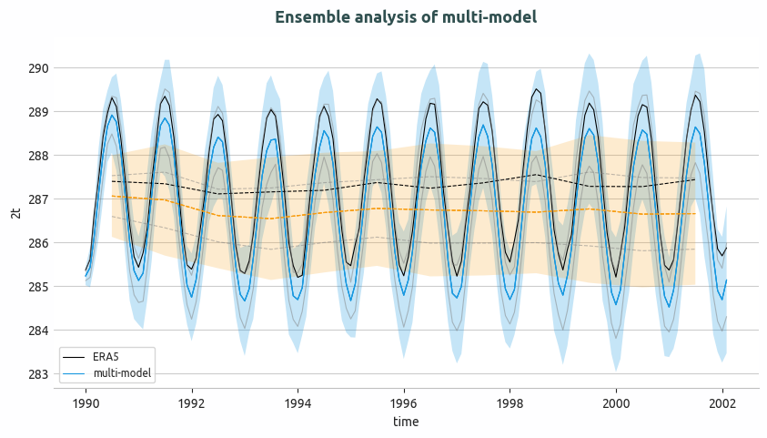

.. _ensemble_timeseries:

Ensemble Time series diagnostic
===============================

Description
-----------

The **Ensemble Time series** diagnostic provides tools to compute and visualize ensemble statistics of 1D time series data:

- Compute ensemble point-wise mean and standard deviation for monthly and annual time series.
- Generate plots showing the ensemble mean and a shaded ±2 standard deviation envelope.
- Compare ensemble statistics with reference datasets (e.g., ERA5).

Classes
-------

There is one class for the analysis and one for plotting:

* **EnsembleTimeseries**: computes ensemble mean and standard deviation for 1D time series data.
  It handles both monthly and annual data, computing statistics point-wise along the time axis.
  Results are saved as class attributes and as NetCDF files.

* **PlotEnsembleTimeseries**: provides methods for plotting time series with the ensemble mean and ±2 standard deviation envelope.
  It supports adding a reference time series for comparison and optionally plotting individual ensemble members.

File structure
--------------

* The diagnostic is located in the ``aqua/diagnostics/ensemble`` directory, which contains both the source code and the command-line interface (CLI) scripts.
* Template configuration files are available in the ``aqua/diagnostics/templates/diagnostics/config-ensemble_timeseries.yaml`` directory.
* Notebooks are available in the ``notebooks/diagnostics/ensemble`` directory and contain examples of how to use the diagnostic.

Input variables and datasets
----------------------------

Before using the diagnostic, input data must be loaded and merged using the ``Reader`` class via
``aqua.diagnostics.ensemble.util.reader_retrieve_and_merge``. The final merged dataset will contain all the requested ensemble members with appropriate metadata.
Alternatively, data can be provided as a list of NetCDF file paths and merged with ``merge_from_data_files``.
The merged dataset must contain all ensemble members concatenated along a dimension named ``ensemble``.

Variables typically used in this diagnostic include:

* ``2t`` (2 metre temperature)

Example: loading and merging a 1D monthly time series ensemble from files:

.. code-block:: python

   import glob
   from aqua.diagnostics import merge_from_data_files

   file_list = glob.glob(
       '/path/to/monthly/timeseries/*.nc'
   )
   file_list.sort()

   ens_dataset = merge_from_data_files(
       variable='2t',
       model_names=['IFS-FESOM', 'IFS-NEMO'],
       data_path_list=file_list,
       loglevel="WARNING",
       ens_dim="ensemble",
   )

Example: loading via the AQUA Reader:

.. code-block:: python

   from aqua.diagnostics import reader_retrieve_and_merge

   ens_dataset = reader_retrieve_and_merge(
       variable='2t',
       catalog_list=['nextgems4', 'climatedt-phase1'],
       model_list=['IFS-FESOM', 'IFS-NEMO'],
       exp_list=['historical-1990', 'historical-1990'],
       source_list=['aqua-atmglobalmean', 'aqua-atmglobalmean'],
       loglevel="WARNING",
       ens_dim="ensemble",
   )

Basic usage
-----------

The basic usage of this diagnostic is explained with a working example in the notebook.
The ensemble analysis is performed on merged ``1D`` timeseries by the ``EnsembleTimeseries`` class.
The basic structure is the following:

.. code-block:: python

    from aqua.diagnostics import EnsembleTimeseries, PlotEnsembleTimeseries

    ts = EnsembleTimeseries(
        var='2t',
        model_list=['IFS-FESOM', 'IFS-NEMO'],
        monthly_data=mon_model_dataset,
        annual_data=ann_model_dataset,
        outputdir='./',
        loglevel='WARNING',
    )

    ts.run()

    ts_plot = PlotEnsembleTimeseries(
        model_list=['IFS-FESOM', 'IFS-NEMO'],
        ref_model='ERA5',
        loglevel='WARNING',
    )

    ts_plot.plot(
        var='2t',
        monthly_data=ts.monthly_data,
        monthly_data_mean=ts.monthly_data_mean,
        monthly_data_std=ts.monthly_data_std,
        annual_data=ts.annual_data,
        annual_data_mean=ts.annual_data_mean,
        annual_data_std=ts.annual_data_std,
        ref_monthly_data=mon_ref_data,
        ref_annual_data=ann_ref_data,
    )

.. note::

    Start/end dates and the reference dataset can be customized.
    If not specified otherwise, plots will be saved in PNG, PDF, and SVG formats in the output directory.

CLI usage
---------

The diagnostic can be run from the command-line interface (CLI) using the following commands:

For unified ensemble diagnostics:
.. code-block:: bash

    cd $AQUA/aqua/diagnostics/ensemble
    python cli_ensemble.py --config <path_to_config_file>

For exclusively running multi-model time series:
.. code-block:: bash

    python cli_multi_model_timeseries_ensemble.py --config <path_to_config_file>

Additionally, the CLI can be run with the following optional arguments:

- ``--config``, ``-c``: Path to the configuration file.
- ``--nworkers``, ``-n``: Number of workers to use for parallel processing.
- ``--cluster``: Cluster to use for parallel processing.
- ``--loglevel``, ``-l``: Logging level. Default is ``WARNING``.
- ``--catalog``: Catalog to use for the analysis.
- ``--model``: Model to analyse.
- ``--exp``: Experiment to analyse.
- ``--source``: Source to analyse.
- ``--outputdir``: Output directory for the plots.
- ``--startdate``: Start date for the analysis.
- ``--enddate``: End date for the analysis.

Configuration file structure
----------------------------

The configuration file is a YAML file that contains details on the dataset to analyse or use as reference, the output directory, and diagnostic settings.

* ``ensemble``: a block (nested in the ``diagnostics`` block) containing options for the Ensemble Timeseries diagnostic.
  Variable-specific parameters override the defaults.

    * ``run``: enable/disable the diagnostic.
    * ``variable``: list of variables to analyse.
    * ``region``: region to analyse (e.g., ``global``).
    * ``startdate`` / ``enddate``: time bounds for plotting/analysis.
    * ``plot_ensemble_members``: if True, plot individual ensemble members as background lines.

Output
------

The diagnostic produces the following outputs:

* Time series plots with ensemble mean and ±2 standard deviation envelope.
* Optional reference dataset comparison.

Data outputs are saved as NetCDF files.

Observations
------------

The default reference dataset is ERA5 reanalysis, provided by ECMWF. Custom reference datasets can be configured in the configuration file.

Example Plots
-------------

    Ensemble of multi-model global monthly and annual timeseries, compared with ERA5. Models considered are IFS-NEMO and IFS-FESOM.

Available demo notebooks
------------------------

Notebooks are stored in the ``notebooks/diagnostics/ensemble`` directory and contain usage examples.

* `ensemble_timeseries.ipynb <https://github.com/DestinE-Climate-DT/AQUA-diagnostics/tree/main/notebooks/diagnostics/ensemble/ensemble_timeseries.ipynb>`_

Authors and contributors
------------------------

This diagnostic is maintained by Maqsood Mubarak Rajput (`@maqsoodrajput <https://github.com/maqsoodrajput>`_, `maqsoodmubarak.rajput@awi.de <mailto:maqsoodmubarak.rajput@awi.de>`_).
Contributions are welcome — please open an issue or a pull request.
